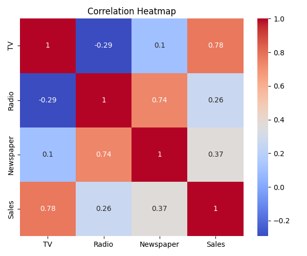
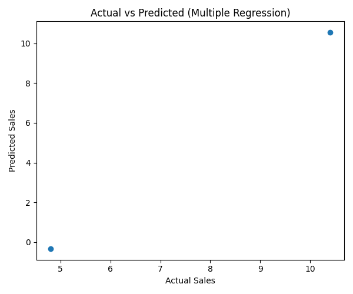
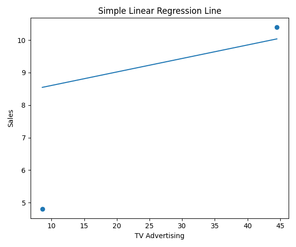

# Sales Revenue Prediction System

This project predicts sales revenue using Simple Linear Regression and Multiple Linear Regression based on advertising spend data.

The goal of this project was to understand how different marketing channels influence sales and to compare single-feature vs multi-feature regression models.

---

## Project Overview

The dataset includes advertising spend across:

- TV
- Radio
- Newspaper

The project compares:

- Simple Linear Regression (using one feature)
- Multiple Linear Regression (using all features)

Model performance is evaluated using:

- R² Score
- Mean Squared Error (MSE)
- Root Mean Squared Error (RMSE)

---

## Tech Stack

- Python
- Pandas
- NumPy
- Scikit-learn
- Matplotlib
- Seaborn

---

## Project Structure

- `data/` → Contains the dataset (`sales_data.csv`)
- `src/`
  - `main.py` → Runs the complete ML pipeline
  - `model.py` → Regression training and evaluation logic
  - `data_preprocessing.py` → Data handling utilities
- `reports/`
  - `predictions.csv`
  - Generated graph images
- `requirements.txt` → Project dependencies

---

## Model Results

### Simple Linear Regression
- R² Score: 0.097
- RMSE: 2.66

### Multiple Linear Regression
- R² Score: -0.68
- RMSE: 3.63

(Note: The dataset used here is small for demonstration purposes, which impacts model performance.)

---

## Visualizations

### Correlation Heatmap


### Actual vs Predicted (Multiple Regression)


### Simple Linear Regression Line


---

## Key Learnings

- Understanding correlation between features
- Implementing Simple and Multiple Regression models
- Comparing model performance using evaluation metrics
- Visualizing model outputs
- Structuring an end-to-end ML project

---

## How to Run

```bash
pip install -r requirements.txt
python src/main.py